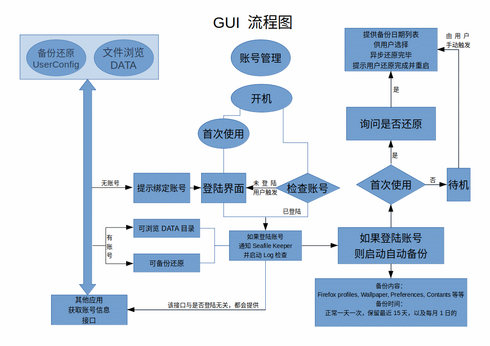
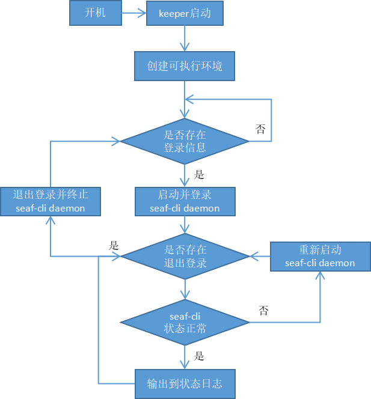

# 需求分析
[基于OneDrive设计的云服务需求分析](https://github.com/openthos/community-analysis/blob/master/%E4%BA%91%E6%9C%8D%E5%8A%A1/%E5%9F%BA%E4%BA%8EOneDrive%E8%AE%BE%E8%AE%A1%E7%9A%84%E4%BA%91%E6%9C%8D%E5%8A%A1%E9%9C%80%E6%B1%82%E6%96%87%E6%A1%A3.md)

# 账号
提供五部分UI
- 账号注册
  - 账号名称合法性验证
  - 密码安全性验证
  - 服务器地址选择（待确定）
  - 注册结果验证
    - 注册成功
    - 帐户名非法
    - 帐户名已被注册
    - 两次密码不一致
    - 网络问题
- 账号登录
  - 账号名称合法性验证
  - 密码安全性验证
  - 地址选择（待确定）
  - 登录结果验证
    - 用户名或者密码错误
    - 网络问题
    - 登录成功
      - 文件管理器出现云服务侧边栏
      - 通知中心出现云服务图标
  - 忘记密码
- 账号查看
  - 用户名查看
  - 服务器地址查看（待确定）
  - 修改密码（待确定）
  - 容量查看
  - 账户注销
  - 关于
- 账号注销
  - 本地文件保留
  - 文件管理器云服务侧边栏消失
  - 通知中心云服务图标消失
- 忘记密码
  - 账号名称合法性验证
  - 验证码
  - 新密码安全性验证
  - 修改结果验证
    - 用户名不存在
    - 验证码错误

# 传输列表
提供三部分UI
- 当前同步状态
  - 同步完成
  - 正在同步
  - 同步异常
    - 网络问题
    - 磁盘已满
    - 网盘已满
    - 文件权限
- 传输列表
  - 文件队列
  - 传输速度
  - 本次启动传输记录（文件名，时间，大小等信息）
  - 传输信息说明
- 选项
  - 打开本地文件夹
  - 在线查看
  - 关于
  - 暂停同步
  - 退出同步

# 文件管理器
- 动态添加左侧云服务侧边栏
- 根据文件状态来添加文件同步状态
- 添加右键云服务操作菜单

（云服务文件同步处理有如下三种模式，需要确定）
- Android模式，根据需求来下载，上传文件
  - 优点
    - 节约空间，可以做到60%模仿OneDrive
  - 缺点
    - 需要三个以上Libiary来实现，分别用于普通存储，系统备份还原，重要文件夹备份
- PC模式，全部保存到本地
  - 优点
    - 方便访问
  - 缺点
    - 空间浪费
- 混合模式
  - 系统备份还原，重要文件夹备份采用PC模式
  - 普通存储采用Android模式
  - 代码复杂，同样需要三个以上Libiary来实现

# Openthos 2.0实现原理
Openthos2.0采用seaf-cli命令行方式来实现云服务，seaf-cli的原理是使用Python通过rpc来调用C/C++代码，由于Android上无法内置Python，使用了proot来运行。由于环境隔离，java与shell相互沟通，还需要通过IO来通信。整体来说，流程图如下：

# 未来云服务框架设计

某种程度上，仿照Seafile Windows版本的设计，系统维护Seafile-deamon的正常运行，应用层提供一个核心云服务，可以通过AIDL跨进程调用获取相应的数据或进行相应的操作；或者直接加载应用层云服务的界面、弹窗，来实现相应的功能。
